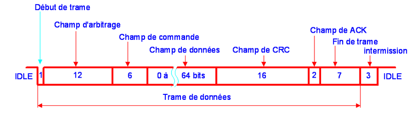

AVDIBEGOVIC Ugo et BENAMMAR Manel 
IESE 5A
# Projet IoT 2023 - Bus CAN sur une prise OBD2

  

Ce projet s’inscrit dans le cadre de notre cours d’IoT. Le projet que nous avons choisi consiste à acquérir différentes données d’une voiture. L'objectif est de récupérer ces données en connectant un microcontrôleur **STM32** à la prise **OBD2**, qui est la prise diagnostique de la voiture, et y lire ainsi les informations via un bus **CAN**. Une fois les informations récupérées via ce système, l'idée est de les envoyer sur un serveur via le réseau **LoRaWan**.

  

Dans ce rapport, nous aborderons tous les aspects importants du projet, depuis l’analyse rapide du marché et au coût de la BOM (Bill of Materials), à des aspects plus techniques tels que l’architecture matérielle ou encore l’implémentation du logiciel embarqué.

  
  

# Analyse du marché et de la concurrence

  

Dans cette partie nous allons tout d’abord analyser le marché. Pour cela, nous allons énoncer les différents clients ou utilisateurs potentiels, nous allons également discuter de la dimension géographique du produit mais aussi de l’évolution globale du marché vis à vis de l’utilisation et le besoin du produit. Enfin, nous présenterons et analyserons les différents produits concurrents existants.

  

La solution que nous proposons ici fait partie du marché de l’automobile. L’objectif principal étant l’acquisition de données de voitures, nos clients potentiels seraient tous les détenteurs de véhicules, mais également les garagistes cherchant une solution rapide et simple d’utilisation. Quant à la dimension géographique d’utilisation de notre produit, on peut dire qu’elle aura une étendue internationale étant donné que la prise OBD2 à bord des voitures est très largement étendue dans le monde. Cette prise a d’ailleurs été intégrée dans la majorité des voitures à partir des années 2000 et a même été rendue obligatoire dans certains pays ou pour certains véhicules.

  

Le système d’analyse que nous proposons utilise donc une prise OBD2 (On Board Diagnostic) permettant l’analyse de données pertinentes et importantes de la voiture. L’utilisation de ce type de système est donc très importante, notamment lors de diagnostics de la voiture, afin de détecter d'éventuels problèmes. Le besoin est donc constamment présent, étant donné que plus d’un milliard de voitures sont en circulation et une bonne partie intègre la technologie que nous utilisons.

  

Le marché étant propice à ce type de solution, différents produits similaires existent déjà. Les produits qui pourraient concurrencer notre produit final sont:

-   les valises diagnostique multimarque. Son fonctionnement est basé sur un calculateur qui analyse et répertorie l'ensemble des codes d'erreur liés au système du véhicule. Le prix varie entre une 40aine d’euros et plusieurs milliers d’euros. Les moins chères sont souvent filaires.
    
-   les scanner de diagnostic, les lecteurs de codes de défauts … similaires a la valise diagnostique, utilisés notamment par les garagistes.
    

  

Pour réaliser le diagnostic avec un tel dispositif, il vous faudra un boitier OBD2 et un logiciel de diagnostic. En effet, en plus du boîtier, un logiciel est nécessaire pour l’acquisition et le traitement des données.

  

Il existe différents types de boîtier OBD similaire au nôtre, déjà présents sur le marché :

-   les boitiers OBD2 **Bluetooth** : cela réalise le diagnostic en se connectant en Bluetooth sur le logiciel avec une application mobile par exemple.
    
-   les boitiers OBD2 **WIFI** : idem que pour le précédent mais en effectuant la connexion en WIFI.
    
-   les boitiers OBD2 **USB** : il ne suffit qu'à connecter le câble USB de votre ordinateur au boîtier.
    

  

Le gros avantage de notre produits par rapport à la concurrence est que le notre affiche plus de données et est configurable, alors que ce genre de produits sont assez restreints dans leur utilisation.

# Architecture globale du système

  

L'architecture globale du système est composée d’une carte microcontrôleur **Nucléo STM32F446**, d’un module **LoRa I-NUCLEO-LRWAN1** placé et programmé sur le microcontrôleur, d’un module driver bus **CAN TJA1050**  ou d’un shield **CAN ks0411** de keyestudio, d’une gateway et enfin d’un serveur permettant d’afficher les données reçues par la Gateway.

  

Les fonctionnalités et les liaisons entre ces différents objets sont les suivantes:

  

-   Le **driver CAN** ou le shield, permettent de récupérer les données depuis la prise OBD2 branchée sur la voiture, via les ports **CAN** du microcontrôleur.
    
-   Le microcontrôleur sera lié au shield ou **driver CAN**, ainsi qu’au module **LoRa**. Il permettra de les utiliser après programmation des différents ports.
    
-   Quant au module **LoRa**, il permettra d’envoyer les données reçues via la prise OBD2 vers la gateway pour afficher les données sur le site **campus IoT**.
    
   
 Architecture globale du système

Notre projet sera divisé en 3 parties :

-   la partie récupération des données sur la STM32 en utilisant le driver CAN de la STM32 et un module driver CAN ou en connectant directement le shield **CAN ks0411** de **keyestudio** sur la STM32, qui sera utilisé en tant qu' interface + driver CAN.
    
-   la partie envoie des données via le réseau LoRaWan grâce au shield **I-NUCLEO-LRWAN1** sur le cloud **campus ioT**.
    
-   la mise en commun des deux fonctions afin de rendre le produit final fonctionnel.
    

  

## Récupération des données via bus CAN

  

Pour récupérer les données avec un bus CAN, il faut avant tout comprendre comment ce protocole de communication fonctionne. Il est basé sur le concept de la diffusion d’information : chaque composant connecté au ports CAN-H et CAN-L du protocole écoute les trames transmises par les composants émetteurs. Ensuite, le composant décide s’il veut juste lire les données ou en envoyer.

  

Avant de pouvoir extraire les données et de les comprendre, il est important d’étudier la constitution de la trame de données. Elle se décompose en 7 parties principales :

-   début de la trame (1 bit)
    
-   champ d'arbitrage (12 bits)
    
-   champ de commande (6 bits)
    
-   champ de données (0 à 64 bits selon la taille)
    
-   champ de CRC (2 bits)
    
-   champ d'acquittement (2 bits)
    
-   fin de la trame (7 bits).
    

Trame du bus CAN
  
Les champs qui nous intéressent le plus sont le champ d'arbitrage pour réussir à identifier le message à la bonne information transmise et le champ de données pour récupérer l’information en question.

 
Une information importante à prendre en compte est que la vitesse de transmission des informations via le bus CAN sur une prise OBD2 est de **500 kbps**.

  
  
  
 
  

## Envoie des données via LoRaWan sur un cloud

  

On a installé la bibliothèque **i-cube-lrwan** afin de pouvoir utiliser de manière simplifiée le module LoRa en ajoutant une liste de commande AT.

  

  
  
  
  
  
  
  
  
  
  
  
  
  
  
  
  
  
  
  
  
  
  
  
  
  
  
  
  
  
  
  
  
  
  
  
  
  
  
  
  
  
  

# Sécurité globale

  

Il n’y a aucune sécurité des données depuis la prise OBD2 jusqu’à la carte STM32 puisqu’il n’y a aucun chiffrage de données. Cependant, la transmission des données à distance se fait en utilisant le protocole LoRaWAN. Cette technologie est sécurisée. En effet, le protocole LoRaWAN définit deux couches de sécurité: une au niveau du réseau et une au niveau de l’application.

 
Chiffrement au niveau réseau et applicatif

Au niveau du réseau, l’authenticité de l’appareil est garantie, assurant l’intégrité entre l’appareil et le serveur réseau.

Quant au niveau de la couche application, il y a un cryptage de bout en bout entre l’appareil et le serveur d’applications, empêchant les tiers d’accéder aux données d’application transmises.

Il y a donc 2 modes de chiffrement:

-   avec la clé AppKey
    
-   avec deux clés: NwkSKey (clé de session réseau) et AppSKey (clé de session d’application) devront être choisies.
    

Elles ont une taille de 128 bits.

  
  

# Respect de la vie privée (RGPD)

  

Bien que les données acquises par la prise OBD2 et donc par notre système soient sensibles, notre appareil ne conserve aucune donnée personnelle. Après utilisation, les données ne sont pas conservées. Les données ne font donc que transiter. L’utilisation du réseau LoRaWAN étant chiffré, seul l’utilisateur de l’appareil a accès aux données. D’après RGPD :

  

Le présent règlement respecte tous les droits fondamentaux et observe les libertés et les principes reconnus par la Charte, consacrés par les traités, en particulier le respect de la vie privée et familiale, du domicile et des communications, la protection des données à caractère personnel, la liberté de pensée, de conscience et de religion, la liberté d'expression et d'information, la liberté d'entreprise, le droit à un recours effectif et à accéder à un tribunal impartial, et la diversité culturelle, religieuse et linguistique.

  

# Architecture matérielle de l'objet

  

Architecture matérielle du système
  
Comme énoncé précédemment lors de la description de l’architecture globale, au niveau matériel, le système est composée d’une carte microcontrôleur **Nucléo STM32F446**, d’un module LoRa **I-NUCLEO-LRWAN1** placé et programmé via le microcontrôleur et d’un module driver bus CAN **TJA1050**  ou d’un shield CAN **ks0411** de keyestudio.

  
  Version 1 avec driver CAN
  

Version 2 avec shield CAN
  

Notre module CAN va récupérer les informations lues sur le bus en brancher les pins CAN-H et CAN-L d’une prise OBD2 directement sur le module. Une fois les données lues, elles vont être envoyées en **SPI** sur le STM32. Enfin, ces données sont envoyées sur le shield XXX qui va s’occuper de les envoyées via le réseau **LoRaWan** sur le cloud **Campus ioT**.

  
  
  
  
  
  
  
  
  
  
  
  
  
  
  

# Coût de la BOM de notre produit

  

Dans cette partie, nous allons lister de façon complète les matières premières, les outils et les composants nécessaires pour fabriquer notre produit.

  

Le tableau 1 présente les différents coûts liés aux différents composants du système.

  
|Matériel|Quantité|Prix unitaire (€)|Prix total (€)|
|--|--|--|--|
|Carte STM32 F446RE  |5000  |14,35  |71 750  |
|Shield LoRa I-NUCLEO-LRWAN1  |5000 |36,40  |182 000  |
|Bopla boîtier 52x50x37  |5000  |1,53  |7 650  |
|Prix de base sans CAN  |  |**52,28**  |**261 400**  |
|Driver CAN TJA1050  |5000  |3,54  |17 700  |
|Prix avec shield CAN  |  |**55,82**  |**279 100**  |
|Shield CAN ks0411  |5000  |10,09  |50 450  |
|Prix avec driver CAN  |  |**62,37**  |**311 850**  |

Tableau 1: Résumé des coût matériel du système d’acquisition de donnée, pour 5000 unités

  
  

Comme on peut le voir dans le Tableau 1, le prix unitaire de notre produit varie selon si on choisit d’utiliser uniquement le driver CAN TJA1050 ou le shield CAN ks0411. Le solution la plus économique serait d’utiliser le driver CAN ce qui implique un gain de 6,55 € par unité soit un gain de 32 750 € sur la production de 5000 produits.

On remarque que notre produit au prix brut serait assez abordable à l’unité.

Cependant, le prix pour la production d’une grande quantité devient vite très conséquent.

  
  
  
  

# Coût de la certification ETSI et LoRa Alliance

  

L’ETSI (Institut Européen des Normes de Télécommunications) est un organisme indépendant qui établit des normes au niveau Européen. Il a pour principale mission de standardiser des normes des Technologies de l’Information et de la Communication et intervient donc au niveau des réglementations dans le secteur des télécommunications.

  

Tout produit utilisant des technologies de l’information et de la communication (TIC) est concerné par leur réglementation. Notre système doit donc posséder une certification ETSI. Elle peut être obtenue par différents prestataires. Celle-ci a un coût qui est de l'ordre de **900 € HT** et a une durée de **3 ans**. Ce certificat a pour but de chiffrer des données et a donc une confidentialité totale dans les informations échangées avec des correspondants. Ce certificat suit la norme **ETSI 319 411-1**. De plus, une certification LoRa Alliance est nécessaire afin d’assurer une interopérabilité et conformité du réseau LoRaWAN en assurant que l’appareil répond aux exigences du protocole LoRaWAN. Cette certification a quant à elle un coût de 1000 dollars, soit un peu **moins de 930 €**.

  
  
  
  
  
  
  
  
  
  
  
  
  
  
  
  
  
  
  
  
  
  
  
  
  
  
  
  
  
  
  
  

# Implémentation du logiciel embarqué

  

En ce qui concerne l’implémentation du logiciel embarqué, celle-ci consiste à choisir le microcontrôleur utilisé sur **STM32CubeIDE** et d’affecter les pins utilisés sur notre microcontrôleur, grâce à la vue IOC. Par la suite, le code se génère automatiquement et utilise des librairies fournies afin de faciliter la programmation. Après avoir implémenté, vérifié et exécuté le code sur notre microcontrôleur, nous pouvons l’utiliser.

 
  Affectation des pins
  
  
 

# Logiciel embarqué

  

Afin de réaliser ce projet, nous avons utilisé **STM32CubeIDE** pour programmer notre carte **STM32f446RE**. On programme sur cet environnement de travail, on compile notre code puis on le téléverser sur la carte via un câble **USB**.

L’avantage de ce logiciel est la possibilité d’utiliser un mode “debug” afin de pouvoir regarder de façon précise, étape par étape, la valeur de tous les registres.

Outils Build, Run et Debug
  

# Métriques du logiciel embarqué

  

Nous avons réalisé deux codes différents : un pour l’utilisation du driver CAN **TJA1050** et un autre pour le shield CAN **ks0411**.

Pour les deux codes, le nombre de ligne de code dans la boucle while  dans le fichier main du projet est de 28 lignes.

  
  
  
  
  

# Durée de vie de la batterie

  

Notre produit final n’aura pas de batterie : il pourra être branché en USB via la prise cigarette de la voiture. Les voitures étant de plus en plus connectées et électriques, il ne serait pas utile d’augmenter nos coûts et de présenter un modèle sur batterie.

De plus, la batterie de la gateway utilisée pour la transmission des données en LoRaWAN a une durée de vie d'une dizaine d'années.

  

# Analyse du cycle de vie  ACV

  
Les impacts environnementaux dépendent de nombreux facteurs : la fréquence d’utilisation, la durée de vie de la carte, les matériaux utilisés pour sa fabrication et la méthode de gestion des déchets.

En effet, les matériaux nécessaires pour la fabrication de notre produits sont principalement des métaux et du plastique, qui sont assez facilement recyclables. Un plus gros problème est la production de déchets électroniques à la fin du cycle de vie du produit, qui peuvent causer des dommages environnementaux importants.

La consommation d’énergie est aussi un point important à considérer. Que cela soit pour sa création et le transport des matières ou son utilisation, la consommation énergétique reste importante. Cependant, dans une utilisation raisonnable de notre produit, il ne consomme pas beaucoup d'électricité. La technologie LoRa permet de réduire la consommation d’énergie, prolonge la durée de vie de la batterie de part sa faible consommation, et réduit de ce fait les déchets liés à l’utilisation de notre appareil.

Ce qui est aussi à prendre en compte est la quantité de gaz à effet de serre émis lors de la création des composants, lors de la production.

  

# Comparaison à la concurrence

  
||Avantages|Inconvénients|
|--|--|--|
|Valise diagnostic pour garagiste|Très complet et simple d’utilisation|Peut être utilisé uniquement à très courte distance (câble USB ou Bluetooth) et peut vite être très cher|
|Notre produit final|Peu cher, pas encombrant, utilisation sur longue distance (protocoles LoRaWAN)|Peut être moins complet que la concurrence|

Tableau 2 : Avantages et inconvénients de notre produit par rapport aux concurrents
  
Dans ce tableau, on remarque que pour le prix de notre produit, l’équivalent sur le marché sera soit beaucoup plus cher pour les mêmes fonctionnalités, soit n’en aura pas autant.

  
  
  
  

# Travail réalisé et problèmes rencontrés

  

Nous avons démarré notre travail en commençant par la conception de la partie CAN, en utilisant l’interface CAN de la STM32. Pour ce faire, nous avons relié au microcontrôleur un driver CAN TJA1050, qui est lui-même relié au lignes CAN-H et CAN-L de la prise OBD2.

  
  

 Montage 1 avec driver CAN

  
  

Après avoir vérifié que le câblage de nos composants était correct et en vérifiant les tensions aux bornes de chaque composant, notre connexion en CAN ne marchait pas. Le problème détecté lors du débogage est que lorsqu’on branche la prise OBD2 sur notre STM32, la récupération des données ne se fait absolument jamais car un buffer du FIFO est toujours vide.

  

Ainsi, au bout de nombreux tests et recherches, nous avons finalement décidé de changer complètement d’approche en abandonnant le driver CAN et en utilisant plutôt le shield CAN ks0411.

  

Montage 2 avec shield CAN
  

Le gros avantage d’utiliser ce deuxième shield est que le montage est plus simple. Il y a donc moins de sources d’erreurs possibles au niveau materiel. Cependant, le gros problème avec ce shield est qu’il a été créé pour être utilisé sous Arduino et non sur STM32. Ainsi, il y avait très peu d’informations sur internet concernant son utilisation sur STM32. Finalement, nous nous sommes basés sur une librairie d’un projet qui a été spécialement créé pour travailler en C sur STM32, à partir de la librairie du constructeur en C++ pour Arduino.

  

Au final, on se retrouve avec le shield qui lit les données de la prise OBD2 grâce au bus CAN, pour les envoyer à la carte STM32 via un bus SPI. On affiche ensuite sur une console Putty les données reçues en direct sur un ordinateur.

  

Malheureusement, nous rencontrons exactement le même problème avec cette démarche. Par manque de temps, nous nous sommes arrêtés là pour le projet.

  
  

# Outils utilisés

  

Afin de réaliser au mieux ce projet, nous avons décidé d’utiliser **STM32Cube IDE** uniquement car c’est un logiciel que nous avons déjà utilisé au cours de nos études. De plus, on trouve que c’est le logiciel le plus adapté pour ce genre de projet, avec une interface facile d’utilisation et avec une rapidité d’exécution lorsqu’on utilise des microcontrôleurs STM32.

  
  
  

# Conclusion

  

Pour conclure, ce projet aborde un secteur qui nous passionne tous les deux énormément : l’automobile. La solution finale prévue est très simple d’utilisation et utile pour toutes les personnes possédant une voiture ayant une prise compatible. Malheureusement, par manque de temps et de par la forte complexité de ce projet, nous n’avons pas pû aller plus loin que la partie réception des données avec le bus CAN. En effet, nous avons rencontré un gros problème avec l’acquisition de ses données : il nous a été impossible de recevoir la moindre information depuis la prise OBD2 de la voiture. Ce problème est d’autant plus difficile à résoudre que nous n’avons aucun moyen de savoir ce qui se passe du côté de la voiture avec la prise OBD2, en ayant aucune information sur les données reçues. Ainsi, avec plus de temps, une des solutions aurait été de d’abord réaliser une communication via un bus CAN entre deux cartes STM32 entre elles afin de s’assurer du bon fonctionnement du bus. Une fois cela réalisé, il aurait été nettement plus simple de l’appliquer à la prise OBD2 de la voiture car on aurait été certain du bon fonctionnement de notre code et du matériel utilisé.

  
  

# Sources

  

[https://www.technologuepro.com/cours-systemes-embarques/cours-systemes-embarques-Bus-CAN.htm](https://www.technologuepro.com/cours-systemes-embarques/cours-systemes-embarques-Bus-CAN.htm)

  

[https://docs.lora.tetaneutral.net/lorawan/crypto/](https://docs.lora.tetaneutral.net/lorawan/crypto/)

[https://www.iot.nc/lorawan-la-securite-est-compromise/#:~:text=Le%20protocole%20LoRaWAN%20d%C3%A9finit%20deux,r%C3%A9seau%2C%20ont%2Dils%20%C3%A9crit](https://www.iot.nc/lorawan-la-securite-est-compromise/#:~:text=Le%20protocole%20LoRaWAN%20d%C3%A9finit%20deux,r%C3%A9seau%2C%20ont%2Dils%20%C3%A9crit).

[https://www.certinomis.fr/produit/serveur-cachet-1-etoile-logiciel-p12](https://www.certinomis.fr/produit/serveur-cachet-1-etoile-logiciel-p12)

  

[https://fr.rs-online.com/web/p/modules-de-developpement-de-communication-et-sans-fil/1438573](https://fr.rs-online.com/web/p/modules-de-developpement-de-communication-et-sans-fil/1438573)

  

[https://controllerstech.com/can-protocol-in-stm32/](https://controllerstech.com/can-protocol-in-stm32/)
